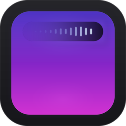
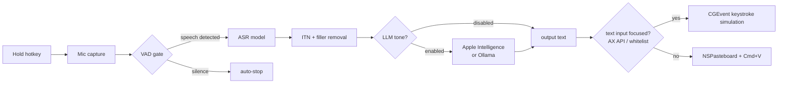

  

  # VoxNotch

  **Dictate into any macOS app using your MacBook's notch.**

  On-device transcription. No cloud. No subscription.

  [Download](#installation) · [Build from source](#building-from-source) · [License](#license)

---

VoxNotch is a macOS menu bar dictation app that uses the MacBook notch as its recording UI. Audio is transcribed locally using Apple Silicon–optimised ASR models (FluidAudio, MLX); nothing leaves the device.

There are other Whisper-based dictation tools, but VoxNotch is built specifically around the notch and around models optimised for Apple Silicon — lower latency, lower memory use, and no dependency on a Python runtime or server process.

## How it works

Hold ⌃⌥ (Control + Option) to start recording. A waveform appears in the notch area while the microphone is active. Release the hotkey to stop; the audio is passed to the selected ASR model and the transcript is delivered to the current application.

Output method depends on whether a text input is focused. The Accessibility API (`AXFocusedUIElement` + `AXRole`) is used to check this — some apps (Chrome, VS Code, Slack, Discord, and others) are whitelisted and always assumed to have a focused input, because their accessibility trees don't reliably expose text roles. If a text input is detected, the transcript is typed character-by-character via CGEvent keystroke simulation. Otherwise it falls back to clipboard paste (writes to `NSPasteboard`, simulates ⌘V, then optionally restores the previous clipboard contents). Each method falls back to the other on failure.

Optional features that run before output: a VAD gate to filter silence at the start/end of recordings, inverse text normalization (ITN), filler word removal, and an LLM post-processing step (see below).

## Installation

### Download

Grab the latest `.dmg` from the [Releases page](https://github.com/owenffff/VoxNotch/releases):

1. Open the `.dmg` and drag **VoxNotch.app** to your Applications folder
2. Launch VoxNotch — macOS will ask for **Accessibility** and **Microphone** permissions on first run
3. The VoxNotch icon appears in the menu bar — hold ⌃⌥ to start recording

Requires macOS 15 Sequoia or later on Apple Silicon.

### Building from source

1. Clone the repo
2. Open `VoxNotch.xcodeproj` in Xcode 16+
3. Set a development team in Signing & Capabilities
4. Build and run the `VoxNotch` scheme (⌘R)

The project uses Swift 6 strict concurrency. Package dependencies (MLX, FluidAudio) are fetched automatically on first build.

## Models

Model weights are downloaded on first use from Hugging Face. After that, transcription works offline.

| Model | Engine | Size | Languages | Notes |
|---|---|---|---|---|
| Parakeet v2 | FluidAudio | ~500 MB | English | Default; lowest latency |
| Parakeet v3 | FluidAudio | ~800 MB | 13+ languages | |
| GLM-ASR Nano | MLX Audio | ~400 MB | Multilingual | Lowest memory use |
| Qwen3-ASR 1.7B | MLX Audio | ~3.4 GB | Multilingual | Better accuracy on Asian languages |
| Custom | MLX Audio | varies | varies | Any MLX-format model from Hugging Face |

While the hotkey is held, left/right arrow keys cycle through models without opening Settings.

## Post-processing

Off by default. When enabled, the raw transcript is passed to a local LLM before output. Supported backends: Apple Intelligence (macOS 15.1+) and Ollama running on localhost.

Built-in prompt presets:

| Preset | What it does |
|---|---|
| Formal Style | Rewrites for professional writing; removes contractions |
| Technical Writing | Formats for technical docs; puts code references in backticks |
| Concise | Removes repetition and filler, preserves meaning |
| Email | Adds greeting and closing; organises into paragraphs |
| Fix Grammar | Corrects grammar and punctuation only; does not alter style |
| Custom | Arbitrary system prompt |

While the hotkey is held, up/down arrow keys cycle through tone presets.

When post-processing is off, ITN and filler word removal still run on-device.

## Hotkeys

| Action | Default |
|---|---|
| Start recording | Hold ⌃⌥ |
| Stop recording | Release ⌃⌥ |
| Cancel recording | Esc (optional, off by default) |
| Cycle model | ⌃⌥ + ← / → |
| Cycle tone | ⌃⌥ + ↑ / ↓ |

The modifier combination is configurable in Settings.

## Limitations

- **Intel Macs are untested.** Apple Silicon is required for the bundled ASR models; Intel support is not a goal.
- **The notch UI requires a Mac with a notch** (MacBook Pro 2021+, MacBook Air M2+). Recording works on any Mac, but there will be no waveform in the notch area.
- **LLM post-processing has hardware requirements.** Apple Intelligence requires macOS 15.1+ on a supported Apple Silicon device. Ollama requires a separately installed and running local instance.
- **Custom models must be in MLX format.** Non-MLX models (e.g. GGUF, CoreML) are not supported.

## Data and privacy

- Audio is kept in memory during transcription and discarded afterwards; it is not written to disk
- Transcripts are stored in a local SQLite database at `~/Library/Application Support/VoxNotch/`; history can be cleared or disabled
- No telemetry or analytics
- Network access occurs only when downloading model weights from Hugging Face

## Requirements

- macOS 15 Sequoia or later
- Apple Silicon (Intel untested)
- Accessibility permission (required for typing into other apps)
- Microphone permission
- Disk space: ~500 MB for the default model; up to ~3.4 GB more for Qwen3-ASR

LLM post-processing additionally requires Apple Intelligence (macOS 15.1+, supported hardware) or a local Ollama instance.

## License

VoxNotch is free software released under the [GNU General Public License v3.0](LICENSE).
